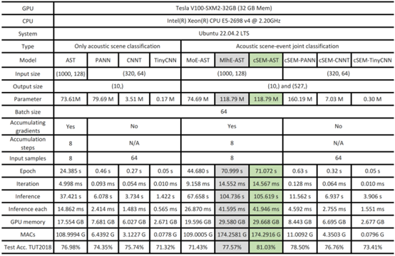

# Supplementary material for Cooperative Scene-Event Modelling for Acoustic Scene Classification

The cSEM is uploading....

## 1. The much simpler baseline

We built 3 simpler baseline models that rely on CNN-based PANN, as shown in Figure 1 below. Due to the space constraints in the paper, we only added the result of simpler Baseline (a) as the simple hierarchical baseline in TABLE XI of the revised paper. 

<h3 align="center"> 

</h3>

 

 
<h3 align="center">Figure 1: The structure of simpler baselines.</h3>

<h4 align="center">Table 1: The results of the simpler baselines on the test set of TUT2018 (models are repeated 10 times: mean ± the maximum error).</h4>
<h3 align="center"> 

</h3>

 

 

We have added the much simpler baseline in Section V-G RQ7 in the revised paper. Specifically, “A simple PANN-based hierarchical baseline with an upper-lower relationship between AE and AS prediction layers is proposed to estimate AE and AS with an explicitly formed hierarchy.” And we have added the result of simple hierarchical baseline in TABLE XI of the revised paper.

## 2. Details of the parameters and computational overhead of models

The cSEM only has the following 9 extra lines of codes, compared with MlhE:

<h3 align="center"> 

</h3>

 

<h4 align="center">Table 2: Table 2: Details of the parameters and computational overhead of models used and proposed in the paper.</h4>
<h3 align="center"> 

</h3>

 

 

Explanation of some terms in Table 2:
1) Accumulating gradients: Since Transformer-based models require a lot of GPU memory during training, we use gradient accumulation technology with reference to Hugging Face: https://huggingface.co/docs/accelerate/usage_guides/gradient_accumulation 
2) Epoch: The time to train an epoch, for the TUT2018 dataset, which contains 4897 samples in the training set.
3) Iteration: The average time to train each sample.
4) Inference: The time required to perform inference on the entire test set. The TUT2018 dataset contains 2518 samples in the test set.
5) Inference each: The average time to perform inference for each sample.
6) MACs: Multiply–Accumulate Operations, which refers to the number of operations performed by the model for multiplication and addition calculations. Since the proposed cSEM has more computational procedures related to the coupling matrix than MlhE, MACs can better reflect the difference in computational overhead between the two.

We have added the number of parameters and computational overhead of the primary models in Table V of Section V-B RQ2 in the revised paper. 

