# Supplementary material for Cooperative Scene-Event Modelling for Acoustic Scene Classification

The cSEM is uploading....

## 1. The much simpler baseline

<i><b>We built 3 simpler baseline models that rely on CNN-based PANN, as shown in Figure 1 below. Due to the space constraints in the paper, we only added the result of simpler Baseline (a) as the simple hierarchical baseline in TABLE XI of the revised paper.</b></i>

<h3 align="center"> 

</h3>

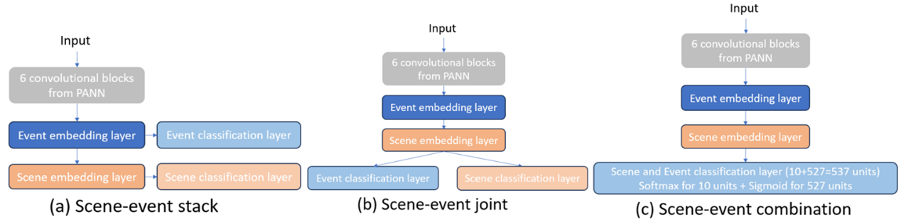 

 
<h3 align="center">Figure 1: The structure of simpler baselines.</h3>

<h4 align="center">Table 1: The results of the simpler baselines on the test set of TUT2018 (models are repeated 10 times: mean ± the maximum error).</h4>
<h3 align="center"> 

</h3>

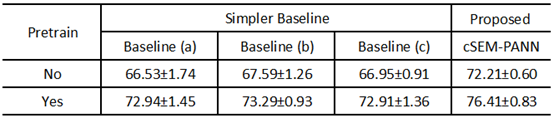 

 

 
<i><b>We have added the much simpler baseline in Section V-G RQ7 in the revised paper. Specifically, “A simple PANN-based hierarchical baseline with an upper-lower relationship between AE and AS prediction layers is proposed to estimate AE and AS with an explicitly formed hierarchy.” And we have added the result of simple hierarchical baseline in TABLE XI of the revised paper.</b></i>
 

## 2. Details of the parameters and computational overhead of models

The cSEM only has the following 9 extra lines of codes, compared with MlhE:

<h3 align="center"> 

</h3>

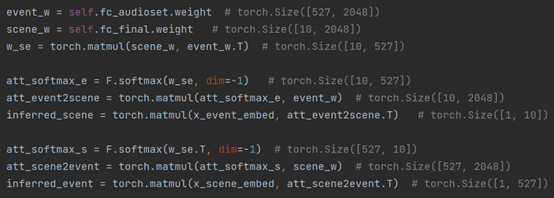 

<h4 align="center">Table 2: Details of the parameters and computational overhead of models used and proposed in the paper.</h4>
<h3 align="center"> 

</h3>

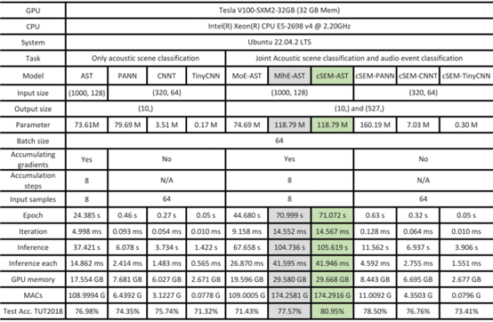 

 

Explanation of some terms in Table 2:
1) Accumulating gradients: Since Transformer-based models require a lot of GPU memory during training, we use gradient accumulation technology with reference to Hugging Face: https://huggingface.co/docs/accelerate/usage_guides/gradient_accumulation 
2) Epoch: The time to train an epoch, for the TUT2018 dataset, which contains 4897 samples in the training set.
3) Iteration: The average time to train each sample.
4) Inference: The time required to perform inference on the entire test set. The TUT2018 dataset contains 2518 samples in the test set.
5) Inference each: The average time to perform inference for each sample.
6) MACs: Multiply–Accumulate Operations, which refers to the number of operations performed by the model for multiplication and addition calculations. Since the proposed cSEM has more computational procedures related to the coupling matrix than MlhE, MACs can better reflect the difference in computational overhead between the two.

<i><b>We have added the number of parameters and computational overhead of the primary models in Table V of Section V-B RQ2 in the revised paper.</b></i>
 

## 3. Comparison of MlhE and cSEM based on AST

<h4 align="center">Table 3: Detailed comparison of MlhE and the proposed cSEM based on AST.</h4>
<h3 align="center"> 

</h3>

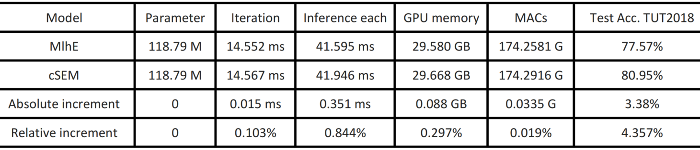 

 

 

As shown in Table 3, compared to MlhE, the parameter increment of cSEM is 0, the relative increment of training (iteration) and inference (each) time is only 0.103% and 0.844%, the absolute increment of required GPU memory is 0.088GB, and the relative increment is only (29.668-29.580)/29.580 ≈ 0.297%. The relative increment of MACs representing the amount of computation is only about 0.019%, but its relative improvement in accuracy is 4.357%, the ratio between the two is 4.460% / 0.019% ≈ 235 times. These metrics reflect the effectiveness of the cSEM framework, which is proposed from the perspective of aligning the core information of AS and AE to achieve a two-way scene-event collaborative classification.
 

In addition, we analyze the differences in accuracy between the proposed cSEM and MlhE results on the TUT2018 test set based on the AST model, and the t-test results showed that these differences are significant (t(18) = 5.21, p < 0.0001).
 

## 4. MlhE-PANN, MlhE-plus-PANN and cSEM-PANN
<i><b>We built MlhE-plus-PANN, which differs from MlhE-PANN in that MlhE-plus-PANN has an additional layer after each scene and event branch.</b></i>

<h4 align="center">Table 4: Result of MlhE-PANN, MlhE-plus-PANN and cSEM-PANN.</h4>
<h3 align="center"> 

</h3>

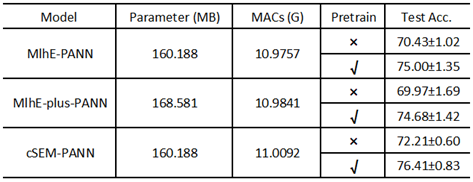 

 

 

<i><b>We have added the results of MlhE-PANN and MlhE-plus-PANN in Table VI of Section V-B RQ2 in the revised paper. Due to the limited space, we only show the results of the models with pretraining in Table VI of Section V-B RQ2 in the revised paper.</b></i>
 

## 5. Comparison of MlhE and the proposed cSEM based on AST on JSSED
<h4 align="center">Table 5: Detailed comparison of MlhE and the proposed cSEM based on AST on JSSED.</h4>
<h3 align="center"> 

</h3>

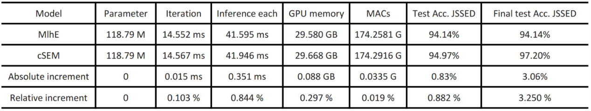 

 

<i><b>We analyzed the differences in accuracy between the proposed cSEM and MlhE results on the TUT2018 test set, and the t-test results showed that these differences are statistically significant (t(18) = 5.21, p < 0.0001).</b></i>

It can be seen from Table 5 that compared with MlhE, the proposed cSEM only increases the number of MACs by 0.0335 G. That is, it only increases the number of operations by 0.019%, but it brings a relative improvement of 0.882% in accuracy as shown in Table 5. If the coupling matrix W_se part of cSEM is simply optimized, the accuracy of cSEM achieved on the JSSED dataset reaches 97.2%. Compared to MlhE, cSEM achieves a relative improvement in accuracy of 3.250% at the cost of 0.019% increase in the computational overhead, and the ratio between the two is 3.25% / 0.019% ≈ 171 times.

<i><b>we have highlighted the differences between the synthetic JSSED dataset and the real-life datasets in the first paragraph of Section V of the revised paper.</b></i>

## 6. Using Ls_by_event and Le_by_scene as the supervised loss 
Due to the space limitation of the paper and the poor performance of the model trained in a self-supervised manner for the scene classification, we did not show it in this journal paper. The results of using supervised Ls_by_e, supervised Le_by_s and supervised coupled Ls_by_e and Le_by_s in the training of cSEM are shown in Table 6 below. 

<h4 align="center">Table 6: Following TABLE VII and TABLE VIII in the paper, λ3 adjusts Ls_by_e, and λ4 adjusts Le_by_s.</h4>
<h3 align="center"> 

</h3>

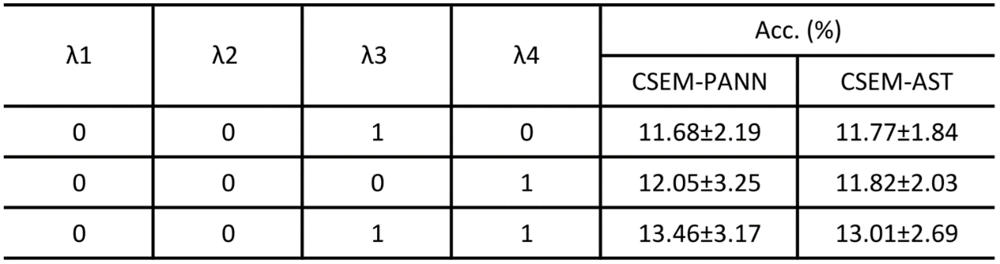 

 
 
<i><b>We have added Table 6’s results of using supervised Ls_by_e, supervised Le_by_s and supervised coupled Ls_by_e and Le_by_s to TABLE VII and TABLE VIII of Section V-C RQ3 in the revised paper, corresponding to #3, #4, #5 in TABLE VII and #3, #4, #5 in TABLE VIII, respectively. We have elaborated the corresponding newly added results in Section V-C RQ3 in the revised paper.</b></i>
 

## 7. Training with event labels with 80% accuracy
<i><b>If the models are both trained with a dataset of 80% AEC accuracy event labels, will the pseudo-labels provide an additional advantage over the real ground-truth labels?</b></i>

<h4 align="center">Table 7: Accuracy (Acc. %) of acoustic scene classification on the JSSED test set.</h4>
<h3 align="center"> 

</h3>

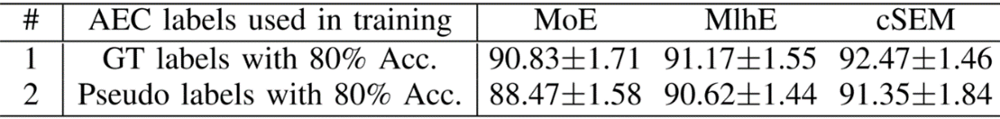 

 

Table 7 shows that the model trained with the training set with ground-true (GT) labels outperforms the model with pseudo-labels. That is, the model in experiment #1 is slightly better than the model in experiment #2, no matter what the framework is. Although pseudo-labels may bring some augmentation effects, wrong information in pseudo-labels can also mislead model learning. In the task of this paper, the results in Table 7 show that ground-true labels are more powerful for acoustic scene classification than pseudo-labels from pretrained models. 
 

<i><b>We have added the results of these experiments performed under the same training AEC label accuracy in TABLE IV of Section V-B RQ2 in the revised paper. Furthermore, we have added two paragraphs in Section V-B RQ2 of the revised paper to discuss the results in Table IV. </b></i>

## 8. Cross-stitch
<i><b>Since cross-stitch is proposed based on CNN-based AlexNet, following the cross-stitch paper, we conduct experiments on cross-stitch based on PANN, which is also a CNN structure, and add the cross-stitch-PANN results to Table VIII in the revised manuscript.</b></i>

<h4 align="center">Table 8: Accuracy (Acc. %) of acoustic scene classification of cross-stitch-PANN on the TUT2018 test set.</h4>
<h3 align="center"> 

</h3>

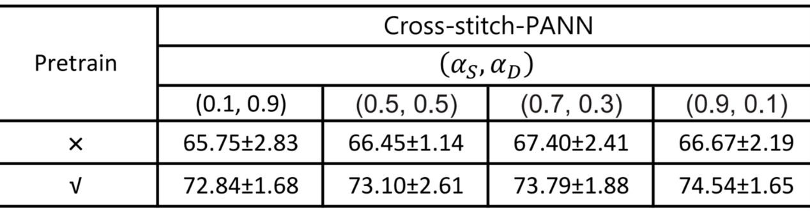 

 

The results in Table 8 show that for cross-stitch-PANN, focusing more attention on learning the representations of the respective tasks works better. This is consistent with the conclusions drawn from Table 1 in the cross-stitch paper.

<i><b>We have included a discussion about the cross-stitch in Section I of the revised paper. We have added the result of the cross-stitch in TABLE XI and shown the differences between them in Section V-G RQ7 of the revised paper.</b></i>
 

## 9. Difference between RGASC and cSEM
<h4 align="center">Table 9: The difference between RGASC and cSEM.</h4>
<h3 align="center"> 

</h3>

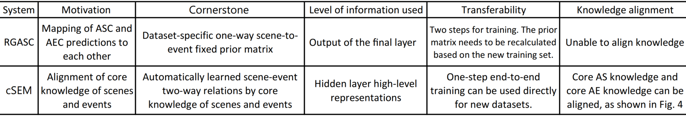 

 

RGASC transforms the final output of ASC and AEC branches through the priori fixed matrix. Hence, the essence of RGASC is to transform the ASC and AEC predictions about scenes and events through a fixed matrix, which is similar to the idea of querying based on an existing table. The cornerstone of RGASC lies in the ASC and AEC predictions, whereas cSEM is dedicated to aligning the core knowledge of scenes and events in the latent space in ASC and AEC. The cornerstone of cSEM is to learn the core knowledge W_s learned by the ASC branch and the core knowledge W_e learned by the event branch. Based on the coupling matrix W_se, cSEM transforms the representations of scenes and events into each other’s semantic space.

<i><b>We have highlighted the difference between RGASC and cSEM in Section I of the revised paper.</b></i>

## 10. Statistically significant difference 
<i><b>The 10 runs results of MlhE and cSEM are shown in Table 10, and t-test result shows that there is a statistically significant difference between MlhE and cSEM results.</b></i>

<h4 align="center">Table 10: The Acc. (%) of MlhE-AST and cSEM-AST on the test set of TUT2018.</h4>
<h3 align="center"> 

</h3>

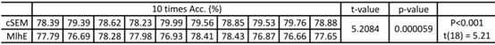 

Take their results on the TUT2018 test set as an example: the results of 10 independent runs of MlhE are [77.79, 76.69, 78.28, 77.98, 76.93, 78.41, 78.43, 76.87, 76.66, 77.65]. The test results of 10 independent runs of cSEM are [78.39, 79.39, 78.62, 78.23, 79.99, 79.56, 78.85, 79.53, 79.76, 78.88]. A parametric test named t-test is conducted to assess the difference between cSEM and MlhE results. The analysis result revealed a significant difference between the results given by the two frameworks (t(18) = 5.21, p < 0.0001), which suggests the proposed cSEM provides a statistically significant improvement in accuracy compared to the MlhE.
  
<i><b>We have added the significant difference statement in Section V-B RQ2 of the revised paper. The highlighted statement is as follows: “Even though some results in Table III are close, the statistics of results of 10 runs of MlhE and cSEM in Table III on TUT2018 reveal that the cSEM provides a statistically significant improvement in ASC accuracy compared to MlhE.” </b></i>

 
 

 

